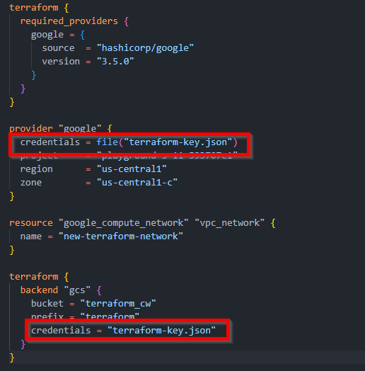
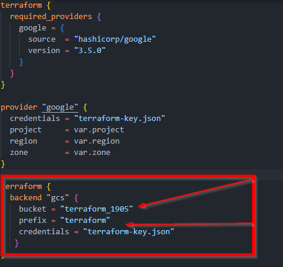
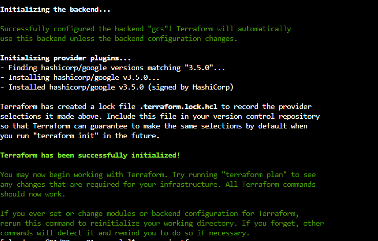

# GCP Deployment with Terraform

This project uses Terraform to deploy a Flask Web Application to GCP and enable Firewall rules to grant access to the Web Server.

To run the solution you first need to perform the below steps:
## Install Terraform:
Before you use Terraform you need to install it, detailed documentation can be found on the [Terraform Site](https://www.terraform.io/downloads) for your respective operating system.

## Install GCP SDK
To interact with the Google Cloud Platform you need to [Install the GCP SDK](https://cloud.google.com/sdk/docs/install)

## Create a new Project for your solution
A GCP Project is a workspace that will be used to manage GCP Services, more information can be found [here](https://developers.google.com/workspace/guides/create-project). Once you have created your project, you need to add the project name to the variable ***project*** in ***variables.tf***

## Create a service account
A service account will be used to interact with with the GCP API to manage resources defined in your Terraform Configuration. Steps to create a service account can be found [here](https://cloud.google.com/docs/authentication/production#create-service-account-console).

Once you have created a service account, add a New Certificate, this will download a JSON file. Add the contents of the file to ***terraform-key.json***

This file is used to authenticate when managing resources with Terraform

**If you are deploying your solution to version control** do not include the terraform-key.json. I have added this file to .gitignore.




## Enable cloud resource manager API
Cloud Resource Manager is the API that allows you to manage resources in GCP, similar to Azure Resource Manager in Microsoft Azure or Cloud Formation in AWS. The following API's need to be enabled:
1. Cloud Resource Manager API
2. Cloud Compute Engine API
3. Cloud Storage API

More information on Cloud Resource Manger can be found [here](https://cloud.google.com/endpoints/docs/openapi/enable-api)

## Setup Terraform Remote State
Remote state writes state data to cloud storage instead of storing it locally in the ```terraform.tfstate```. 
1. In this project we will be storing our state in a GCP Bucket. Documentation on creating a bucket can be found [here](https://cloud.google.com/storage/docs/creating-buckets)
2. Create a folder in the newly created bucket called terraform

**! Please note**  bucket names need to be globaly unique, please update the main.tf file to reflect your ```Bucket``` and ```Folder``` names. e.g.:



## Update variables.tf
To ensure the solution runs correctly you neet to update the below values in the variables.tf to reflect your environment:
1. project: The project name should reflect the project you created.
3. region: Update the region to your location
4. zone: Update the zone to your current zone

## startup.sh

The ```startup.sh``` file is a Bash script that will be executed by terraform  using the ```metadata_startup_script = file("startup.sh")``` command in ```main.ts```.
The script performs the following tasks:
1. Installs Python
2. Installs Flask
3. Creates an ```app.py``` file
4. Runs the Flask application


## Build the Solution
### Terraform Init
From you project folder run ```terraform init``` this will initialise your project and download the resources defined in your configuration file.

If your solution is correctly configured, you will get the below output:


**!** If you make changes to the configuration file, you will need to run ```terraform init --reconfigure```

### Terraform Plan
From the project folder run ```terraform plan``` this will output the execution plan for your infrastrucutre as defined in your configuration files.

### Terraform Apply
Before applying the changes confirm the infrastrucutre is correctly defined by reviewing the output of ```terraform plan```. If it is correct, run ```terraform apply```


### Terraform Destry
Run ```terraform destroy``` to delete any resources created by Terraform